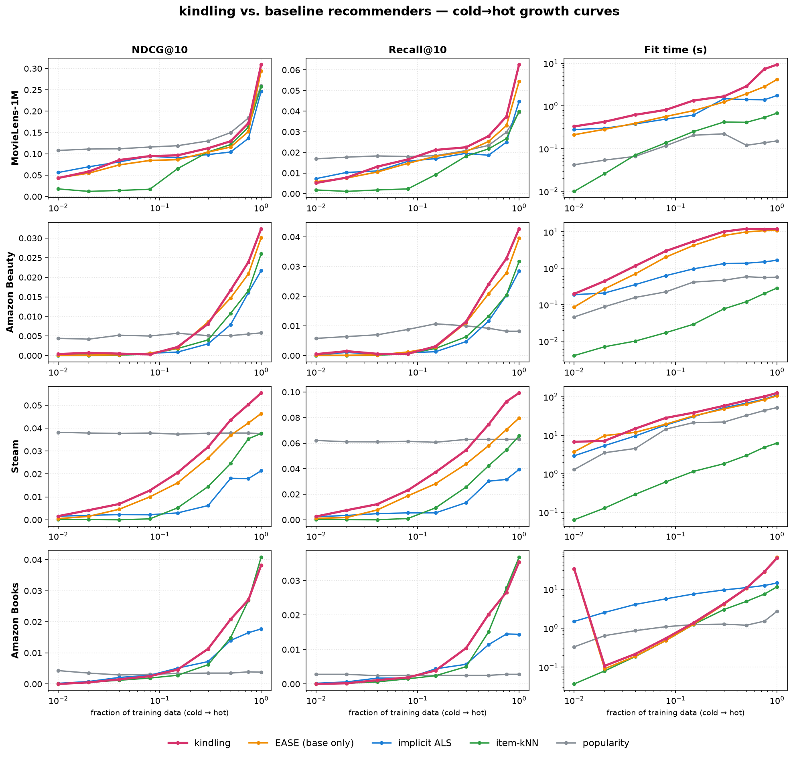

# kindling: a recommender that grows with your data — and what building it taught me

I'm open-sourcing **[kindling](https://github.com/rhoekstr/kindling)**, a hybrid
recommender with no training loop, no GPU, and a Rust core that serves
recommendations in well under a millisecond. This post is half announcement,
half field notes — because the most useful thing I can hand you alongside the
code is an honest account of how it got here, including the parts that didn't
work and the one trap that nearly fooled me at the end.

## What it is

kindling builds **one fused score per (user, item)** from a closed-form base
plus a handful of z-normalized counting-statistic channels, and the whole stack
**configures itself from your data at `fit()` time** — there's no config to tune
your way into a good model.

- **The base** is EASE (a closed-form item-item ridge) for catalogs up to ~20k
  items, and wilson-normalized co-occurrence above that, where the dense solve
  stops being feasible. The 20k cutoff is a parameter — raise it on a bigger box.
- **The channels** — recent-trend, last-item, sequential transitions, user–user
  CF — each **turn themselves on only when the data warrants it**, decided by a
  held-out lift test. Timestamps activate trend; true ratings activate
  rating-weighting; on a static random split the sequential channels gate *off*
  rather than add noise.
- **A repeat module** re-surfaces the things people actually re-buy — but only on
  datasets where re-buying genuinely predicts the future (more on the trap below).
- **A Rust core** does the entire recommend path: single calls in
  sub-millisecond, a batch path that runs in parallel with the GIL released.

There's also an opt-in **EASE+** base (the EDLAE denoising variant). I evaluated
it carefully and left it *off by default* — which is its own small story.

## Where it stands

Here's accuracy from cold to hot data against the standard baselines, one row
per dataset:

The pink line is kindling. Two things to notice. On the **discovery** rows
(MovieLens, Steam, books), watch the left edge: at the very coldest data, plain
popularity is competitive — and kindling *knows* to lean on that prior, then
pulls away as signal accumulates. That crossover is the design thesis in one
picture. On the **repeat-regime** rows (marked `⟳`, evaluated so that re-orders
count), kindling separates from the field entirely: on the Dunnhumby grocery log
it scores **0.48 NDCG@10 versus ~0.05 for every baseline**, because it recommends
what you're about to re-buy and the baselines can't.

## ~Two months, and more dead ends than wins

I started this repo on April 20th; it's a bit over 200 commits and two months
later. If you scan the git log expecting a clean march toward the architecture
above, you'll be disappointed — and that's the honest part I want to share. The
log is a lab notebook, and most entries are experiments that **didn't work**:

- An **embedding-imputation program** to fill cold items from content — wired
  across three phases, with a passing synthetic control — that never beat the
  plain stack in any real regime. Closed, negative.
- A **force-directed projection** retrieval idea that landed *below the
  popularity floor* on top-K accuracy. Dead.
- **Metadata→co-occurrence grafting**, alive-but-marginal on rich catalogs and
  dead on thin ones — a niche tool, not the universal cold-start fix I'd hoped.

Across thirty-some benchmark scripts and a shelf of saved repros, the ratio of
negative to positive results was not close. I've come to think that ratio is the
*value*, not a tax on it: every closed door is a door the next idea doesn't have
to knock on. The discipline that made it cheap was writing the repro, running
it, and **recording the verdict** — so "we lacked the data to test this" never
quietly became "this doesn't work."

The thing that actually moved the needle wasn't a clever model. It was a
**diagnostic**: decomposing the error into *retrieval-bound* (the right item
never made the candidate pool) versus *ranking-bound* (it was there but
mis-ranked). That lens showed raw co-occurrence collapsing toward a popularity
ranking — which pivoted the base to EASE — and told me, per dataset, whether to
spend effort on retrieval or on ranking. Diagnose where the ceiling is *before*
trying to raise it.

## Then I rewrote the hot path in Rust — without breaking anything

The middle stretch was porting the entire recommend path to a Rust core,
**parity-first**: reproduce the existing engine *exactly* — the reference NDCG
numbers and byte-for-byte recommendation lists were the gate — before changing a
single behavior. Every phase had a differential harness comparing Rust against
the Python reference.

That discipline bought something I didn't fully appreciate until the end:
**confidence to delete.** Once parity was the contract, I could rip out ~2,000
lines — the whole Python recommend path and an orphaned feature package — and
trust the gate to catch drift. Single calls went from ~200 ms to
**sub-millisecond**, and *every accuracy result I'd already earned still held.*

The most instructive bug of that stretch was, of all things, **tie-breaking**.
The user-CF channel ranks neighbors by a highly discrete similarity, so dozens
tie *exactly* at the cutoff; numpy leaves the order among ties unspecified, and
nothing in Rust can reproduce an unspecified order. The fix was a deterministic
secondary key on both sides — reproducible, NDCG-neutral. Knowing which
differences to fix and which to live with turned out to be most of the work.

## The repeat trap, and a gate that had to learn the difference

The last chapter was the most surprising. On grocery and retail logs, the single
most useful thing a recommender can do is surface what you're about to *re-buy* —
but the standard evaluation **hides exactly that** by excluding already-seen
items, and the standard model **masks it** for the same reason. Un-hide it and
the repeat module is transformative: +68% over a "buy-it-again" baseline on
Ta-Feng, ~10× the field on Dunnhumby.

The trap was deciding *when* to turn it on. My first instinct — a threshold on
how often users repeat items — fails on a dataset like Steam, which has a *higher*
repeat rate than Ta-Feng yet where the module **hurts**: re-logging a game you
already own isn't a purchase intent, it's noise. Re-logging is not repurchase,
and no count can tell them apart.

So the gate had to actually *test* it: build a held-out, turn the module on and
off, and keep it only if it strictly helps. Getting that right taught me the
sharpest lesson of the project — **a held-out gate has to mirror the benchmark's
split protocol or it lies to you.** My first held-out held out each user's most
recent items, which over-represents re-logs, and it confidently kept Steam. Only
when I rebuilt the gate around the *same chronological-global split the benchmark
uses* — leak-free, with real timestamps so the timing logic behaves as it would
at serve time — did it cleanly decline Steam and keep the genuine grocery logs.
It decides correctly, automatically, with no hand-set threshold.

**EASE+** got the same honest treatment and the opposite verdict. The denoising
variant beats plain EASE on three datasets and loses on a fourth, and a held-out
search couldn't reliably tell which was which — so rather than ship a "win" that
doesn't hold everywhere, it's an opt-in flag. A tempting upgrade that isn't
universal is better offered than imposed.

## Why it might be useful to you

If you want personalized recommendations without standing up a GPU, a feature
store, or a training pipeline — `pip install`, `fit`, `recommend`, and you have a
model that adapts its own behavior to your data's shape and serves in
microseconds. It persists to a self-contained artifact you can load in a serving
process with no re-fit; there's a `KindlingServer` class and a small FastAPI
example to make that a five-minute job. If your data is grocery- or
retail-shaped, the repeat handling turns itself on and earns its keep; if it
isn't, it stays out of the way.

The full benchmark record — including all the negative results, which really are
half the value — is in [`docs/EXPERIMENTS.md`](EXPERIMENTS.md), the synthesized
takeaways in [`docs/LESSONS.md`](LESSONS.md), and the repeat-gate mechanism in
[`docs/REPEAT-GATE.md`](REPEAT-GATE.md).

Kindling, in the end, is a small bet: that closed-form models, gated honestly per
dataset and made fast in Rust, can go a long way before you reach for anything
heavier. Two months of mostly-failed experiments — and one gate that had to be
taught the difference between a habit and a coincidence — are the evidence I have
that it's a bet worth making. The code is on GitHub; I'd love to hear where it
breaks for you.
